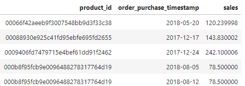
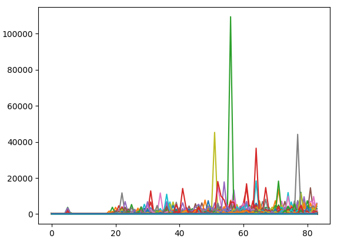

## Quickstart

### For Users

**How to set up**

1. Go to [package repository](https://github.com/knightzhang1314/ecommerce-test) and download preferred verion of the application.

2. Install the wheel package into your environment.

```
$ pip install ds-(version)-py3-none-any.whl
```
### Final table structure



### Data Graph



### For Developers

You can use any preferred virtual environment.

Here is the instruction with [Miniconda](https://docs.conda.io/en/latest/miniconda.html).

```sh
# create a virtual environment
$ conda create -y --name=ds python=3.9
# activate it
$ conda activate ds
# upgrade your pip installation
pip install --upgrade pip
# install required libraries for production
pip install -r requirements.txt
```

#### How to execute it locally

```sh
# move to src folder
$ cd src
# you can add or delete the config yaml, if you have different scope then add after config
# you can change the platform in the entrypoint.
# execute
$ python entrypoint.py
```

#### How to run in notebook, you can check the [notebook](https://github.com/knightzhang1314/ecommerce-test/blob/dev/notebook/sales_predict.ipynb)


#### How to deploy the package

```sh
# pull the latest code into local
$ git pull origin develop
# merge this to main branch
$ git merge main
# create the tag on main branch
$ git tag vX.X.X (e.g. git tag v0.0.1)
# push the tag to GitHub
$ git push origin vX.X.X (e.g. git push origin v0.0.1)
```

GitHub Actions run after the pushing and request the approval from code owner automatically. Once it is approved, the package will be automatically released.
